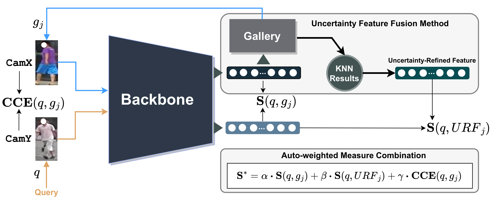

# ReID: Uncertainty Feature Fusion & K-NN Weighted Re-Ranking

Based on the following works:
- **Enhancing Person Re-Identification via Uncertainty Feature Fusion and Auto-weighted Measure Combination** [[paper]](https://www.sciencedirect.com/science/article/abs/pii/S0950705124013716?via%3Dihub)
- **A Re-Ranking Method Using K-Nearest Weighted Fusion for Person Re-Identification** [[paper]](https://www.scitepress.org/Link.aspx?doi=10.5220/0013176100003905)

## Pipeline

## Prerequisites

Before running the script, make sure you have the following dependencies installed:

- [pytorch>=0.4](https://pytorch.org/)
- torchvision

And other additional dependencies and version requirements:

```bash
pip install -r requirements.txt
```

Compile with cython to accelerate evalution:
```bash
cd utils/rank_cylib; make all
```

## Datasets
Download links: ([Market-1501](https://drive.google.com/file/d/0B8-rUzbwVRk0c054eEozWG9COHM/view), [MSMT17](https://arxiv.org/abs/1711.08565), [DukeMTMC-reID](https://arxiv.org/abs/1609.01775))

Change the path to the dataset root by modifying `DATASETS.ROOT_DIR` in the corresponding config file located in the `configs` directory.
## Model Weights
You can find model weights in following repositories:
- **BoT**: [BoT](https://github.com/michuanhaohao/reid-strong-baseline), [FastReID](https://github.com/JDAI-CV/fast-reid/blob/master/MODEL_ZOO.md)
- **CLIP-ReID**: [CLIP-ReID](https://github.com/Syliz517/CLIP-ReID/tree/master)

Change the path to the model weights by modifying the `TEST.WEIGHT` in the corresponding configuration file in the `configs` directory. For example, in `configs/market1501.yml`, update the following line:

```yaml
TEST:
  WEIGHT: "path/to/your/model_weights.pth"
```

Ensure that the correct path for the downloaded model weights is provided.

## Test

To test the ReID framework, run the following command:

```bash
python3 tools/test.py --config_file='configs/market1501.yml' --seed 0 --k 4 --n_triple 1000 --baseline bot
```

#### Arguments:
- `--config_file`: Path to the configuration file.
- `--baseline`: Choose the baseline model: "clip" or "bot". Default is "bot".
- `--k`: Top-k similarity based on uncertainty. Default is 5.
- `--n_triple`: Number of data triples used for training. Default is 1000.
- `--seed`: Set a specific random seed for reproducibility. Default is 0.
- `--re_rank`: Rerank using KwF: "none", "uniform", "inv_dist_pow" or "exp_decay". Default is "none"

Additional arguments for the command line interface:
- `--uffm_only`: Use this flag to only apply the Uncertain Feature Fusion Method (UFFM).
- `--out`: Directory where the output will be saved. Default is "output".

The test results may vary slightly (up to ±0.1) from those reported in the paper, depending on the hardware.
## Acknowledgement
Codebase from [BoT](https://github.com/michuanhaohao/reid-strong-baseline), [CLIP-ReID](https://github.com/Syliz517/CLIP-ReID/tree/master) and [FastReID](https://github.com/JDAI-CV/fast-reid.git)
## Citation

If you use this code for your research, please cite

```ref
@article{CHE2025112737,
title = {Enhancing person re-identification via Uncertainty Feature Fusion Method and Auto-weighted Measure Combination},
journal = {Knowledge-Based Systems},
volume = {307},
pages = {112737},
year = {2025},
issn = {0950-7051},
doi = {https://doi.org/10.1016/j.knosys.2024.112737},
url = {https://www.sciencedirect.com/science/article/pii/S0950705124013716},
author = {Quang-Huy Che and Le-Chuong Nguyen and Duc-Tuan Luu and Vinh-Tiep Nguyen}
}

```
```ref
@conference{icpram25,
author={Quang-Huy Che and Le-Chuong Nguyen and Gia-Nghia Tran and Dinh-Duy Phan and Vinh-Tiep Nguyen},
title={A Re-Ranking Method Using K-Nearest Weighted Fusion for Person Re-Identification},
booktitle={Proceedings of the 14th International Conference on Pattern Recognition Applications and Methods - ICPRAM},
year={2025},
pages={79-90},
publisher={SciTePress},
organization={INSTICC},
doi={10.5220/0013176100003905},
isbn={978-989-758-730-6},
issn={2184-4313},
}

```

  


